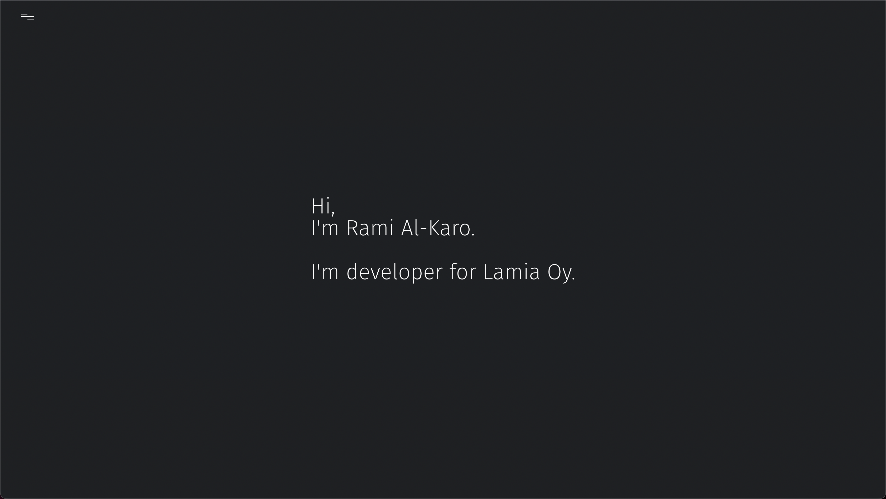

## Welcone to my github account.

I do some web development and work as full-time frontend developer for [LamaiaOy](https://lamia.fi/).

Along side that also I work as freelancer for various web application and contiuous development of existing project. Such as [Laskutan](https://www.laskutan.com/) is belong to [SRG Oy](https://www.srgyhtiot.fi/) which is Light entrepreneurship invoice platform. Another example is [Corrsy](https://corrsy.com) which is eduction platform focus on middle east student. 

[Rami Al-karo Portfolio](https://ramialkaro.fi)
 

 
 
Examples of web application which are open source. 

* See ☁️  weather information using city name and in respone you will get (min/max/current temp, pressure, clouds, wind, humidity, date, weather status) [weather.ramialkaro.fi](https://weather.ramialkaro.fi/)
